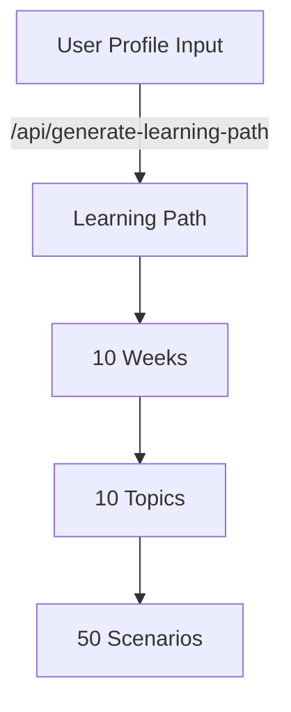
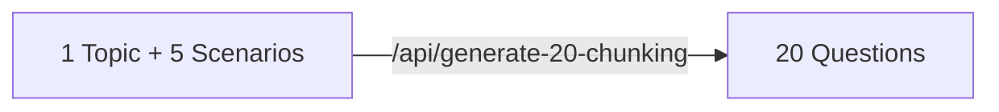
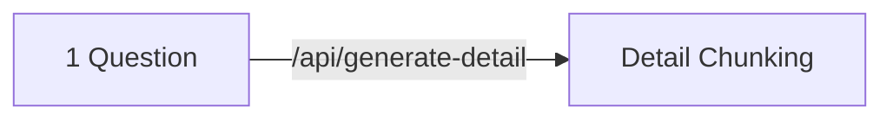
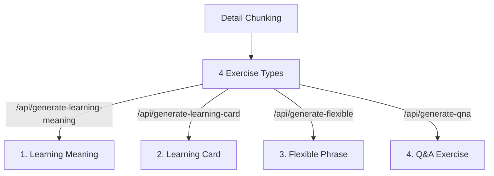

# Learning Path Architecture

## A. User Profile => Learning Path (10 Weeks)


**Input:** 
- Industry
- Job
- English Level 
- Learning Goals

**Output:**
- 10 Weeks Learning Path
- Each Week: 1 Topic + 5 Scenarios

## B1. Topic + 5 Scenarios => 20 Chunking Questions


**Input:**
- User Profile
- Week number + 1 Topic name + 5 Scenarios

**Output:**
- 20 Chunking Questions

## B2. 1 Question => 1 Detail Chunking


**Input:**
- User Profile
- Week number + Topic name + 1 Scenarios + 1 Chunking Questions

**Output:**
- Detail Chunking: Question + 3 phrases Chunking: Eng and Vietnamese

## B3. Detail Chunking => 4 Exercise Types


**Each Exercise Contains:**
1. **Learning Meaning:**
   - Multiple choice questions
   - Answer explanations

2. **Learning Card:**
   - English/Vietnamese pairs
   - IPA pronunciation

3. **Flexible Phrase:**
   - Fill in blanks
   - Progressive difficulty

4. **Q&A Exercise:**
   - Practice questions
   - Sample answers

## Data Flow Summary
1. User inputs profile → Gets 10-week learning path
2. Select week/topic → Get 20 chunking questions
3. Select question → Get detailed chunking
4. Each detail → Generate 4 types of exercises


==========

Ah, bạn nói đúng! Tôi sẽ thiết kế lại kiến trúc tập trung vào luồng dữ liệu và dependency giữa các feature:

```typescript
src/
├── features/
│   ├── A_LearningPathGen/           # Feature A: Generate Learning Path
│   │   ├── types/
│   │   │   ├── input.ts
│   │   │   │   export interface UserProfileInput {
│   │   │   │       industry: string;
│   │   │   │       job: string;
│   │   │   │       englishLevel: string;
│   │   │   │       learningGoals: string[];
│   │   │   │   }
│   │   │   │
│   │   │   └── output.ts
│   │   │       export interface LearningPathOutput {
│   │   │           weeks: WeekData[];     // 10 weeks
│   │   │           topics: TopicData[];   // 10 topics
│   │   │           scenarios: ScenarioData[]; // 50 scenarios
│   │   │       }
│   │   │
│   │   └── services/
│   │       └── learningPath.service.ts
│   │           export const generateLearningPath = async (
│   │               input: UserProfileInput
│   │           ): Promise<LearningPathOutput>
│   │
│   ├── B1_ChunkingGen/             # Feature B1: Generate 20 Chunking
│   │   ├── types/
│   │   │   ├── input.ts
│   │   │   │   export interface ChunkingInput {
│   │   │   │       learningPath: LearningPathOutput; // From A
│   │   │   │       selectedWeek: number;
│   │   │   │       selectedTopic: TopicData;
│   │   │   │   }
│   │   │   │
│   │   │   └── output.ts
│   │   │       export interface ChunkingOutput {
│   │   │           questions: QuestionData[]; // 20 questions
│   │   │           topic: TopicData;
│   │   │       }
│   │   │
│   │   └── services/
│   │       └── chunking.service.ts
│   │           export const generateChunking = async (
│   │               input: ChunkingInput
│   │           ): Promise<ChunkingOutput>
│   │
│   ├── B2_DetailGen/               # Feature B2: Generate Detail
│   │   ├── types/
│   │   │   ├── input.ts
│   │   │   │   export interface DetailInput {
│   │   │   │       chunking: ChunkingOutput;  // From B1
│   │   │   │       selectedQuestion: QuestionData;
│   │   │   │   }
│   │   │   │
│   │   │   └── output.ts
│   │   │       export interface DetailOutput {
│   │   │           question: string;
│   │   │           structure: string;
│   │   │           translations: Translation;
│   │   │       }
│   │   │
│   │   └── services/
│   │       └── detail.service.ts
│   │           export const generateDetail = async (
│   │               input: DetailInput
│   │           ): Promise<DetailOutput>
│   │
│   └── B3_ExerciseGen/            # Feature B3: Generate 4 Exercises
│       ├── types/
│       │   ├── input.ts
│       │   │   export interface ExerciseInput {
│       │   │       detail: DetailOutput;  // From B2
│       │   │   }
│       │   │
│       │   └── output.ts
│       │       export interface ExerciseOutput {
│       │           learningMeaning: Exercise;
│       │           learningCard: Exercise;
│       │           flexiblePhrase: Exercise;
│       │           qna: Exercise;
│       │       }
│       │
│       └── services/
│           └── exercise.service.ts
│               export const generateExercises = async (
│                   input: ExerciseInput
│               ): Promise<ExerciseOutput>
│
├── core/
│   ├── store/                    # Global State Management
│   │   └── learning.store.ts
│   │       export interface LearningState {
│   │           // Output from A
│   │           learningPath: LearningPathOutput | null;
│   │           
│   │           // Output from B1
│   │           currentChunking: ChunkingOutput | null;
│   │           
│   │           // Output from B2
│   │           currentDetail: DetailOutput | null;
│   │           
│   │           // Output from B3
│   │           currentExercises: ExerciseOutput | null;
│   │           
│   │           // Navigation state
│   │           currentWeek: number;
│   │           currentTopic: TopicData | null;
│   │           currentQuestion: QuestionData | null;
│   │       }
│   │
│   └── coordinator/              # Điều phối luồng dữ liệu
│       └── learning.coordinator.ts
│           export class LearningCoordinator {
│               // A -> B1
│               async selectWeekAndGenerateChunking(
│                   week: number,
│                   learningPath: LearningPathOutput
│               ): Promise<ChunkingOutput>
│               
│               // B1 -> B2
│               async selectQuestionAndGenerateDetail(
│                   question: QuestionData,
│                   chunking: ChunkingOutput
│               ): Promise<DetailOutput>
│               
│               // B2 -> B3
│               async generateExercisesFromDetail(
│                   detail: DetailOutput
│               ): Promise<ExerciseOutput>
│           }
│
└── shared/
    └── types/                   # Shared type definitions
        ├── common.types.ts
        └── api.types.ts
```

**Luồng dữ liệu được đảm bảo thông qua Coordinator:**

```typescript
// core/coordinator/learning.coordinator.ts
export class LearningCoordinator {
    constructor(
        private store: LearningStore,
        private learningPathService: LearningPathService,
        private chunkingService: ChunkingService,
        private detailService: DetailService,
        private exerciseService: ExerciseService
    ) {}

    // Khởi tạo luồng từ A
    async initializeLearningPath(profile: UserProfileInput) {
        const learningPath = await this.learningPathService.generateLearningPath(profile);
        this.store.setLearningPath(learningPath);
        return learningPath;
    }

    // A -> B1
    async selectWeekAndGenerateChunking(week: number) {
        const learningPath = this.store.getLearningPath();
        if (!learningPath) throw new Error('Learning path not initialized');

        const chunkingInput: ChunkingInput = {
            learningPath,
            selectedWeek: week,
            selectedTopic: learningPath.topics[week - 1]
        };

        const chunking = await this.chunkingService.generateChunking(chunkingInput);
        this.store.setCurrentChunking(chunking);
        return chunking;
    }

    // B1 -> B2
    async selectQuestionAndGenerateDetail(questionId: string) {
        const chunking = this.store.getCurrentChunking();
        if (!chunking) throw new Error('Chunking not generated');

        const selectedQuestion = chunking.questions.find(q => q.id === questionId);
        if (!selectedQuestion) throw new Error('Question not found');

        const detailInput: DetailInput = {
            chunking,
            selectedQuestion
        };

        const detail = await this.detailService.generateDetail(detailInput);
        this.store.setCurrentDetail(detail);
        return detail;
    }

    // B2 -> B3
    async generateExercisesFromDetail() {
        const detail = this.store.getCurrentDetail();
        if (!detail) throw new Error('Detail not generated');

        const exerciseInput: ExerciseInput = { detail };
        const exercises = await this.exerciseService.generateExercises(exerciseInput);
        this.store.setCurrentExercises(exercises);
        return exercises;
    }
}
```

**Sử dụng trong components:**

```typescript
// Example usage in component
const LearningPathComponent = () => {
    const coordinator = useContext(LearningCoordinatorContext);
    
    const handleWeekSelect = async (week: number) => {
        try {
            // A -> B1
            const chunking = await coordinator.selectWeekAndGenerateChunking(week);
            
            // B1 -> B2
            const detail = await coordinator.selectQuestionAndGenerateDetail(
                chunking.questions[0].id
            );
            
            // B2 -> B3
            const exercises = await coordinator.generateExercisesFromDetail();
            
            // Navigate to exercise view
            navigate('/exercises');
        } catch (error) {
            handleError(error);
        }
    };
    
    return (/* JSX */);
};
```

Kiến trúc này đảm bảo:
1. Dữ liệu được truyền đúng từ A -> B1 -> B2 -> B3
2. Mỗi feature có input/output types rõ ràng
3. Coordinator quản lý luồng dữ liệu tập trung
4. Store lưu trữ state của từng bước
5. Error handling cho từng bước

Bạn thấy kiến trúc này đã đảm bảo được luồng dữ liệu chưa?
