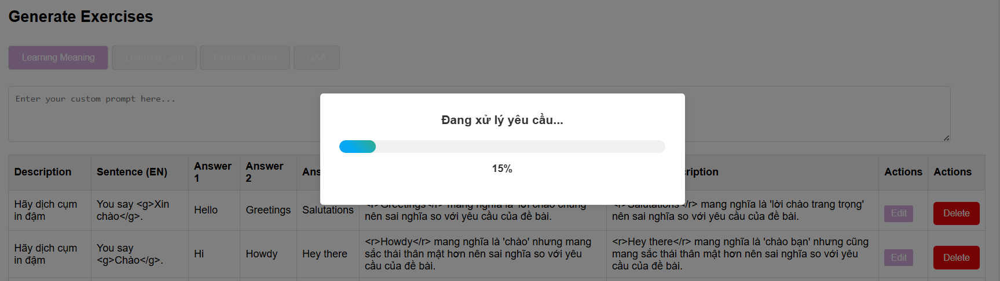

# MiniProduct_FlowContentEnglishTheCoach_StepUpE_T102024

Colab with PO: Hoàng Đức Minh: https://github.com/Hngdcmnh

HOW TO PUSH - update How to PUSH REPO 2 REPO: 
1. Lên repo gốc: https://github.com/DoanNgocCuong/MiniProd_ContentEngFlow_StepUpE_T102024/ tạo 1 nhánh deploy mới
2. Github Desktop check out branch mới
3. Dọn dẹp và giữ lại bản deploy mới
4. Push: 
```bash
git remote add destination https://github.com/Hngdcmnh/content-the-coach
```
 ```bash
git push --force destination refs/heads/deploy1.4:refs/heads/deploy1.4
```
------
Enumerating objects: 95, done.
Counting objects: 100% (95/95), done.
Delta compression using up to 16 threads
Compressing objects: 100% (85/85), done.
Writing objects: 100% (94/94), 424.98 KiB | 3.51 MiB/s, done.
Total 94 (delta 19), reused 9 (delta 1), pack-reused 0 (from 0)
remote: Resolving deltas: 100% (19/19), done.
To https://github.com/Hngdcmnh/content-the-coach
   4b5a6f6..123d09d  deploy1.4 -> deploy1.4
(base) PS D:\OneDrive - Hanoi University of Science and Technology\GIT2\MiniProd_ContentEngFlow_StepUpE_T102024> 

---

---

# Tối ưu XỬ LÝ. 

1. TỐI ƯU DOCKER TỪ 100s còn 2-10s 
2. Tối ưu = max workers = 5 API cùng lúc. 
3. Tối ưu Cache: 
- Tự động làm mới cache khi có thay đổi dữ liệu. 
- Gen sẵn tất cả bài học ngay sau khi Gen Questions
- Chuyển đổi tab tức thì không cần đợi API
- Tăng tốc x2-x3 quá trình sinh nội dung mới


