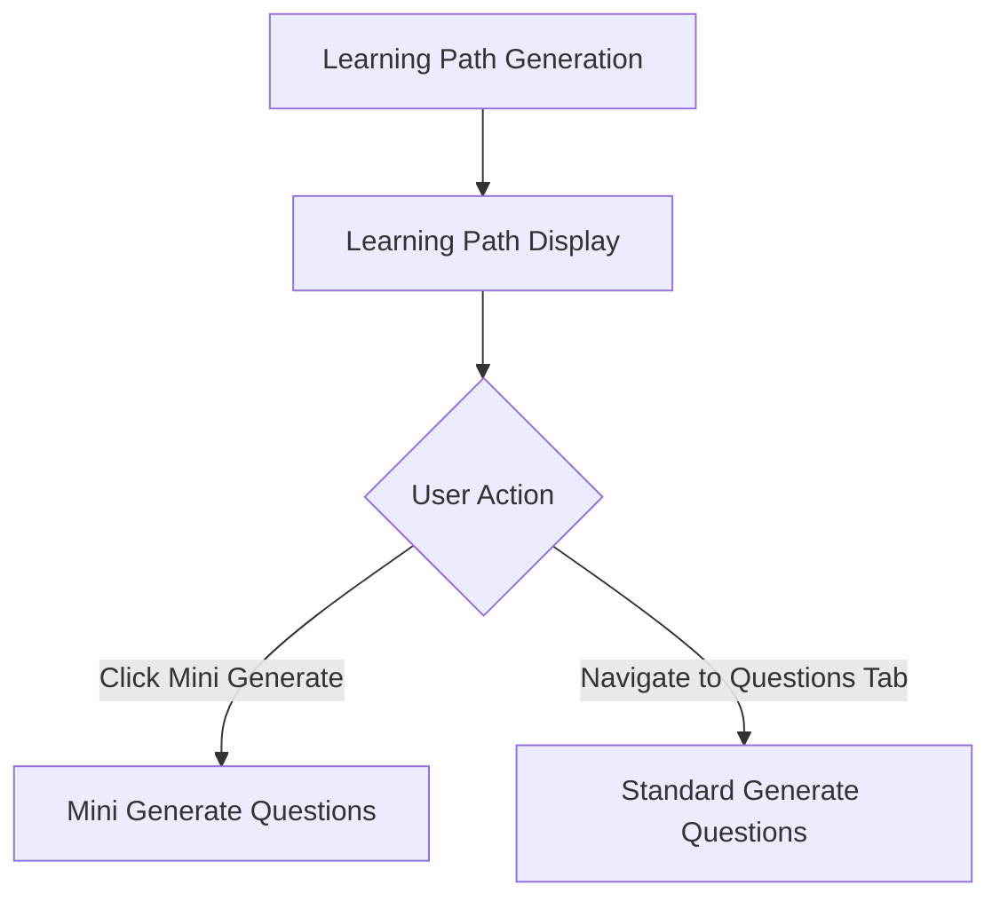

# Báo Cáo: Luồng Generate Learning Path đến Generate Questions
Ngày: 27/03/2024

## 1. Tổng Quan Luồng Xử Lý
Hệ thống có 2 luồng generate questions:
1. **Luồng Chính**: Sử dụng form input truyền thống
2. **Luồng Mini**: Generate questions trực tiếp từ learning path scenarios

### 1.1 Sơ Đồ Luồng


## 2. Chi Tiết Triển Khai

### 2.1 Thêm Nút Mini Generate
```javascript
// Trong LearningPathRenderer._renderPathSection
<div class="scenario-container">
    <li>${scenario.scenario}</li>
    <button class="mini-generate-btn" 
        data-week="${week.week}"
        data-topic="${week.topic}"
        data-scenario="${scenario.scenario}">
        Mini Generate
    </button>
</div>
```

### 2.2 Xử Lý Event Mini Generate
```javascript
_handleMiniGenerate(week, topic, scenario) {
    // 1. Lấy user profile từ learning path data
    const userProfile = this.data.user_profile_description;
    
    // 2. Tạo input string
    const miniGenerateInput = `Generate 5 English questions.
        User Profile: [${userProfile}]
        Topic: [${topic}]
        Scenario: [${scenario}]`;
    
    // 3. Gọi API
    const response = await fetch('/generate-questions', {
        body: JSON.stringify({ generateQuestionInput: miniGenerateInput })
    });
}
```

## 3. Các Thành Phần Chính

### 3.1 Learning Path Component
- **File**: `learningPath.js`
- **Classes**: 
  - `LearningPathManager`: Quản lý logic nghiệp vụ
  - `LearningPathRenderer`: Xử lý hiển thị

### 3.2 Question Generation Component
- **File**: `generateQuestion.js`
- **Functions**:
  - `handleGenerateClick()`: Xử lý generate từ form
  - `processApiResponse()`: Xử lý kết quả từ API

## 4. Luồng Dữ Liệu Chi Tiết

### 4.1 Luồng Mini Generate
1. **Input Collection**:
   ```javascript
   {
     userProfile: "From learning path data",
     topic: "From scenario data-topic",
     scenario: "From scenario data-scenario"
   }
   ```

2. **API Request Format**:
   ```javascript
   {
     generateQuestionInput: "Generate 5 English questions...[context]"
   }
   ```

3. **Response Processing**:
   ```javascript
   {
     questions: [...],
     total: number,
     requestedCount: number
   }
   ```

### 4.2 Luồng Standard Generate
1. **Form Input**:
   - Topic
   - Level
   - Number of questions
   - Extra requirements

2. **Processing**:
   - Validate input
   - Create prompt
   - Call API
   - Display results

## 5. Xử Lý Lỗi và Validation

### 5.1 Input Validation
```javascript
if (!this.data || !this.data.user_profile_description) {
    throw new Error('User profile data not found');
}
```

### 5.2 API Error Handling
```javascript
try {
    const data = await response.json();
    if (data.error) {
        throw new Error(data.error);
    }
} catch (error) {
    console.error('Error:', error);
    alert('Failed to generate questions: ' + error.message);
}
```

## 6. UI/UX Considerations

### 6.1 Mini Generate Button Styling
```css
.mini-generate-btn {
    padding: 3px 8px;
    background-color: #2196F3;
    color: white;
    border-radius: 4px;
    font-size: 12px;
    margin-left: 10px;
}
```

### 6.2 Results Display
- Questions displayed in existing question container
- Maintains consistency with main generate flow
- Reuses existing table structure

## 7. Cải Tiến Có Thể Thực Hiện

### 7.1 Performance
- Implement caching for mini generate results
- Batch processing for multiple scenarios

### 7.2 UX Improvements
- Add loading indicators
- Preview questions before generation
- Batch generate for multiple scenarios

### 7.3 Error Handling
- More detailed error messages
- Retry mechanism for failed requests
- Offline support

## 8. Testing Checklist
- [ ] Mini generate button appears correctly
- [ ] Input string format is correct
- [ ] API calls succeed
- [ ] Results display properly
- [ ] Error handling works
- [ ] UI is responsive
- [ ] Cache works correctly

## 9. Deployment Notes
1. Ensure API endpoint is configured correctly
2. Update documentation for new feature
3. Monitor error rates and performance
4. Collect user feedback

## 10. Maintenance
- Regular testing of both flows
- Monitor API usage and performance
- Update prompts as needed
- Regular code reviews